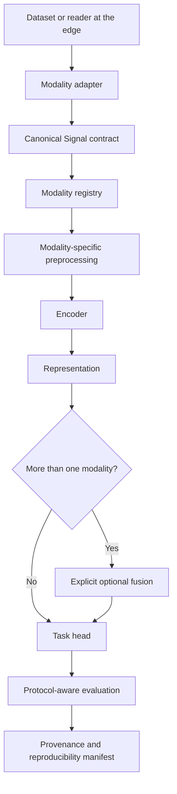

# BioSignal-FM V4

[](https://doi.org/10.5281/zenodo.22095717)

🚀 **[Live Interactive Demo](https://biosignal-fm-qussai-bme.streamlit.app/)

> **BioSignal-FM is a modular, research-only platform for reproducible multimodal biosignal workflows.** It provides signal contracts, modality-aware preprocessing, representation-learning components, protocol-aware evaluation utilities, and provenance controls for auditable research development.

BioSignal-FM **does not claim** that this repository contains a scientifically validated foundation model, a clinical device, a diagnostic system, or a regulatory-cleared product. Real-data performance claims require a documented dataset, license, protocol, split, seeds, baselines, and reproducible artifacts.

## Why V4

V4 consolidates the previous implementation into a single compatible platform rather than creating a parallel codebase. It preserves useful loaders, preprocessing, models, and evaluation tools while adding a canonical signal contract, a modality registry, explicit data provenance, and a clear separation between the research core and optional application layers.

| Modality | V4 status | Public interpretation |
|---|---|---|
| EMG | Core | Supported through a compatibility-preserving research path. |
| EEG | Core | Supports MNE/BIDS-facing adapters at the edge; MNE is not a core dependency. |
| ECG | Core | Has its own loading and preprocessing path; it is not an EMG alias. |
| ECoG / iEEG | Experimental | Contract and adapter extensibility only; no V4 benchmark claim. |
| fNIRS | Optional legacy extension | Retained for compatibility, not part of the V4 core definition. |

## Architecture



The core contract is intentionally independent of MNE, WFDB, FastAPI, Streamlit, and PyTorch. Those packages belong to adapters or application layers, not the minimum research core.

## Installation

BioSignal-FM requires **Python 3.10 or later**. The default installation is deliberately small and contains only the core and lightweight CLI.

```bash
python -m pip install --upgrade pip
python -m pip install biosignal-fm
```

Install only the capabilities required by your work.

| Need | Installation |
|---|---|
| Scientific preprocessing and conventional pipelines | `python -m pip install 'biosignal-fm[scientific]'` |
| PyTorch models and training | `python -m pip install 'biosignal-fm[ml]'` |
| EEG loading through MNE | `python -m pip install 'biosignal-fm[data-eeg]'` |
| ECG loading through WFDB | `python -m pip install 'biosignal-fm[data-ecg]'` |
| fNIRS extension | `python -m pip install 'biosignal-fm[data-fnirs]'` |
| Streamlit interface | `python -m pip install 'biosignal-fm[ui]'` |
| FastAPI service | `python -m pip install 'biosignal-fm[api]'` |
| ONNX export and runtime inference | `python -m pip install 'biosignal-fm[deployment]'` |
| Local provenance and run manifests | Included in the base package; see `RunManifest`. |
| Local development with all optional capabilities | `python -m pip install -e '.[all]'` |

The legacy `fm` and `data` extras remain during the V4 transition. New integrations should use the focused extras above. External MLflow tracking is deliberately deferred because the latest released MLflow dependency range conflicts with the Cryptography security baseline; see the [pre-publication evidence register](docs/references_prepublication_review_2026.md).

## Quick start

Inspect the installed package and modality registry without loading data or a model:

```bash
bsfm info
bsfm inspect
bsfm inspect --modality ecog
```

The following example deliberately creates synthetic data. Its provenance remains explicit, so it cannot be used as a benchmark or clinical result.

```python
from biosignal_fm.data import make_synthetic_sample
from biosignal_fm.modalities import default_registry

legacy_sample = make_synthetic_sample(modality="emg")
emg_adapter = default_registry().get("emg").adapter_factory()
signal = emg_adapter.to_signal(legacy_sample)

assert signal.metadata.modality == "emg"
assert signal.is_synthetic
assert signal.metadata.provenance.details["benchmark_eligible"] is False
```

## Canonical signal contract

V4 makes the data transferred between layers explicit. A dataset, participant, session, recording, task, and window are not collapsed into a dataset-specific opaque object.

| Type | Responsibility |
|---|---|
| `SignalMetadata` | Modality, sampling rate, channels, units, participant, session, recording, task, and window context. |
| `SignalProvenance` | Data origin, version, license, adapter, fallback reason, and evidence classification. |
| `Signal` | Immutable `(channels, samples)` data with metadata, timestamps, events, and optional missingness mask. |
| `SignalBatch` | A documented signal collection that can expose modality and synthetic-data composition. |
| `ModalityRegistry` | Explicit adapter, preprocessing factory, supported tasks, optional dependencies, and maturity for each modality. |

## Real data and synthetic data

Synthetic data exists for smoke tests, interface demonstrations, and development paths. It is labeled in the contract, service outputs, and CLI.

> **Integrity rule:** A result obtained from synthetic data must not be described as a benchmark, baseline improvement, scientific inference, or clinical performance.

The CLI requires explicit opt-in for a synthetic pretraining smoke path:

```bash
bsfm pretrain --config configs/exp.yaml --steps 1 --synthetic-demo
```

For a real research result, use a real-data loader and registered adapter, document the license and data provenance, lock the split protocol, and preserve the run manifest.

## Multimodal research flow

`ResearchPipeline` enforces the following order:

```text
Signal → preprocessing → encoder → representation → optional fusion → task head
```

When more than one modality is present, the default path requires an explicit fusion strategy before the task head. The project does not infer arbitrary missing-modality robustness or cross-modal transfer simply because it can register more than one modality.

## Evaluation and reproducibility

The project includes LOSO and LODO utilities, participant-level aggregation, accuracy and macro-F1 metrics, calibration, confidence intervals, and statistical helpers. These tools are not a universal research protocol. Each study must define its dataset version, units of analysis, split, fitting scope, metrics, baselines, and inference plan.

For small cross-participant studies, the participant or the protocol-defined experimental unit—not the count of signal windows—is the appropriate unit of inference.

`RunManifest` records the random seed, Git head and dirty state, configuration hash, Python and package environment, runtime context, protocol, dataset provenance, and output hashes.

```python
from biosignal_fm.reproducibility import RunManifest

manifest = RunManifest.create(
    name="emg-smoke-test",
    dataset_provenance={"origin": "synthetic", "benchmark_eligible": False},
    protocol={"name": "smoke-test", "split": "none"},
)
manifest.save("runs/emg-smoke-test/manifest.json")
```

## Local and network service modes

The service binds to `127.0.0.1` by default. Binding to all interfaces is an explicit deployment decision:

```bash
# Local development
BSFM_API_KEY='replace-with-a-strong-secret' bsfm serve --port 8000

# Network-facing service: use only behind a reverse proxy with TLS, request limits,
# audit logging, and an environment-managed API key.
BSFM_API_KEY='replace-with-a-strong-secret' \
  bsfm serve --public --model-dir ./checkpoints --port 8000
```

The REST API uses `X-API-Key` for mutating and inference endpoints. The WebSocket endpoint accepts the API key in its **first message**, never in a query parameter. Checkpoints must be staged by the operator inside the configured model directory; registration accepts only a relative path within that directory.

Do not commit API keys, raw biosignal data, credentialed-data access material, or real-data manifests containing sensitive identifiers. See the [data governance policy](docs/data_governance.md) and [deployment guide](docs/deployment.md).

## Explicit non-claims

| Not supported by V4 without additional evidence | V4 position |
|---|---|
| A scientifically validated foundation model | A possible research direction, not a current claim. |
| State-of-the-art or real benchmark results | Requires real data, a locked protocol, seeds, baselines, and reproduced results. |
| Clinical or diagnostic readiness | Not supported by this repository. |
| Regulatory clearance or compliance certification | Regulatory material is informational only. |
| A benchmarked ECoG result | Not available; the path is experimental. |
| Missing-modality robustness or zero-shot transfer | Requires dedicated, documented experiments. |

## Documentation

| Document | Purpose |
|---|---|
| [V4 architecture](docs/architecture_v4.md) | Contracts, boundaries, modality registry, and multimodal flow. |
| [Migration notes](docs/migration_notes_v4.md) | Compatibility, deprecations, and the v3.3-to-V4 transition. |
| [Migration closure audit](docs/migration_audit_v4.md) | Evidence for the completed V4 migration work. |
| [Scientific integrity audit](docs/scientific_integrity_audit_v4.md) | Synthetic-data policy, claim boundaries, and protocol controls. |
| [Data governance](docs/data_governance.md) | Dataset licenses, credentialed data, provenance, and prohibited egress. |
| [Pre-publication risk register](docs/prepublication_risk_register_2026.md) | Release findings, severity, and remediation decisions. |
| [External evidence register](docs/references_prepublication_review_2026.md) | Current research, regulatory, data, and supply-chain sources used in the release review. |
| [Release verification report](docs/test_report_v4.md) | Measured verification results for the V4 release. |
| [V4 roadmap](docs/roadmap_v4.md) | Prioritized work for real data, Git, ECoG, CI, and deployment. |

## Contributing and release policy

Read [CONTRIBUTING.md](CONTRIBUTING.md) before contributing. Every new dataset or modality must include an adapter, metadata, provenance and license handling, preprocessing configuration, contract tests, and honest documentation of the available evidence.

The project is licensed under [Apache License 2.0](LICENSE). Changes are recorded in [CHANGELOG.md](CHANGELOG.md). Security issues should follow [SECURITY.md](SECURITY.md).
