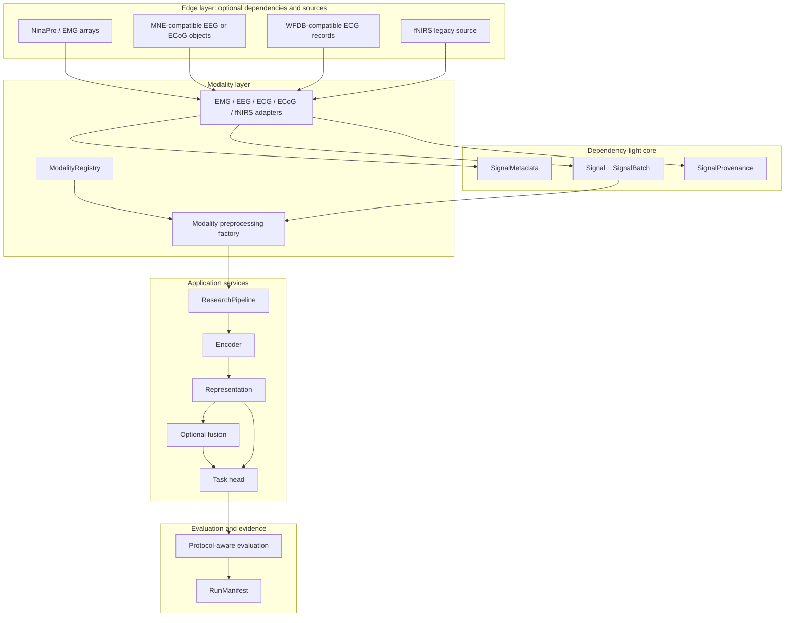

# BioSignal-FM V4 Architecture

## Purpose and scope

BioSignal-FM V4 is a modular multimodal biosignal research platform, not a ground-up replacement. It standardizes signals, metadata, and provenance while preserving useful loaders, preprocessing paths, encoders, and evaluation utilities behind explicit, testable boundaries.

> **Scientific position:** V4 supports future research toward biosignal foundation models. It does not by itself establish that a foundation model has been trained, generalized, or scientifically evaluated at the scale required for that claim.

## Layer map



| Layer | Responsibility | Must not do |
|---|---|---|
| `core` | Signal, batch, provenance, metadata, and structural validation contracts. | Import MNE, WFDB, PyTorch, UI, or HTTP libraries. |
| `modalities` | Modality declaration, adapter, preprocessing factory, and capabilities. | Turn the registry into hidden plugin behavior or embed modality branches in the core. |
| `data` | Read or create V3.3-compatible samples. | Treat synthetic data as a benchmark or scientific inference. |
| `preprocessing` | Modality-aware signal transformations. | Put research logic in UI callbacks or API routes. |
| `services` | Enforce the research operation order and consume contracts. | Depend on Streamlit, FastAPI, or a particular dataset reader. |
| Application | CLI, UI, API, export, and deployment clients. | Own a research algorithm separate from the core. |
| Evaluation | Metrics, splits, statistics, and reports. | Treat windows as independent participants or mix demo data with real benchmarks. |

## Canonical contracts

The core defines dependency-light types that rely only on the standard library and NumPy.

| Type | Key guarantee |
|---|---|
| `DataOrigin` | Explicit classification: `real`, `synthetic`, or `unknown`. |
| `SignalProvenance` | Source, version, license, adapter, fallback reason, and auditable details. |
| `SignalMetadata` | Modality, sampling rate, channels, units, participant, session, recording, task, and window identifiers. |
| `Signal` | Immutable 2D `float32` array with metadata-consistent channels, events/timestamps, and optional missingness mask. |
| `SignalBatch` | Non-empty collection that exposes modalities and synthetic-data composition. |

An adapter's `to_signal` method converts a legacy V3.3 sample, transparent array, or compatible reader object into `Signal`. The source object remains outside the core so MNE, WFDB, and dataset-specific structures do not become architectural requirements.

## Modality registry

The in-process registry is explicit and small. Every entry declares an identifier, maturity, adapter, preprocessing factory, tasks, visualization, reference datasets, and optional dependencies.

| Identifier | Status | Adapter | Evidence position |
|---|---|---|---|
| `emg` | Core | `EMGAdapter` | Compatibility path; every performance claim still needs real data and protocol evidence. |
| `eeg` | Core | `EEGAdapter` | MNE/BIDS-compatible concepts at the edge. |
| `ecg` | Core | `ECGAdapter` | Dedicated preprocessing distinct from EMG. |
| `ecog` | Experimental | `ECoGAdapter` | No V4 benchmark claim. |
| `fnirs` | Optional legacy | `FNIRSAdapter` | Not required by the V4 core. |

A new modality should normally add an adapter, registry declaration, preprocessing factory, configuration, tests, and documentation—not edit core control flow.

## Standard research flow

`ResearchPipeline` enforces the following order:

```text
SignalBatch
  → preprocessors by modality
  → encoder produces a Representation per Signal
  → optional FusionStrategy for multimodal input
  → TaskHead receives exactly one representation
  → PipelineResult carries prediction and data-evidence label
```

If a batch has more than one modality and no `FusionStrategy` is supplied, the pipeline stops with a clear error instead of silently applying late fusion inside a task head. The task head receives a fused representation for multimodal paths and a single representation otherwise.

## Data, provenance, and evaluation

Every `Signal` carries structured provenance. `PipelineResult` labels its output `synthetic_demo` when any input signal is synthetic; a client must not promote that label to `benchmark` or `scientific_inference` automatically.

`RunManifest` records a run identifier, UTC time, Git head and dirty state, environment fingerprint, configuration hash, seed, output hashes, metrics, dataset provenance, protocol, and runtime context. A dirty Git state remains visible and is not represented as a clean release.

## Dependency placement

| Category | Examples | Architectural placement |
|---|---|---|
| Core | NumPy, PyYAML, Typer, Rich | Contracts, configuration, lightweight CLI. |
| Scientific | SciPy, scikit-learn, pandas, matplotlib | Processing, evaluation, conventional pipelines. |
| Models | PyTorch | Models and training only. |
| Data readers | MNE, WFDB, h5py | Optional modality loaders and adapters. |
| Application | Streamlit, FastAPI, Uvicorn, ONNX Runtime | Optional UI, API, and export. External MLflow tracking is deferred pending secure upstream compatibility. |

The core installation does not force every category. Extras in `pyproject.toml` install only the capabilities a user selects.

## Compatibility and migration

`BiosignalSample`, `BiosignalDataset`, and NinaPro, MIT-BIH, EEGMMID, and fNIRS loaders remain available. A modality adapter maps a legacy sample into the V4 contract. The names `FoundationModel` and `DistilledFoundationModel` remain for compatibility but represent encoder/representation implementations; their legacy names are not scientific claims.

## Test boundaries

V4 protects its boundaries with tests for signal contracts, the modality registry, legacy conversion, fusion-before-head ordering, data provenance, and prevention of modality/UI imports inside `core`. Existing valid unit and integration tests remain part of regression protection.
